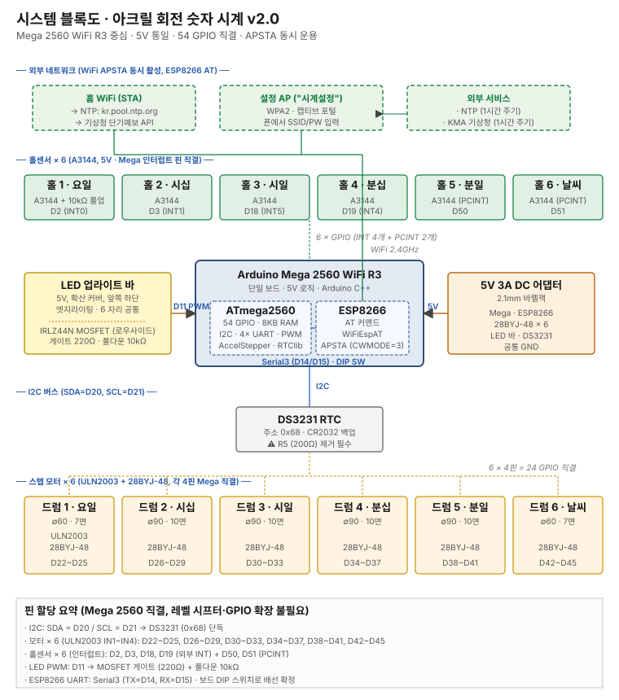

# Uplight Rotating Clock (아크릴 회전 숫자 시계)

24시간제 디지털 시계. 6개의 독립 회전 드럼(요일 · HH:MM · 날씨)이 수직축을 중심으로 회전하며, 전면 아크릴 패널의 레이저 각인에 앞쪽 하단 5V LED 바가 엣지라이팅으로 빛을 주입하여 산란 발광시킨다.

---

## 현재 상태 (2026-05-10 기준)

- **Phase 0 (요구·치수 확정)** ✅ 완료
- **Phase 1 (핵심 설계 결정)** ✅ 완료 (D22~D35 Phase 2 진행 중 추가, 총 35건)
- **Phase 2 (6자리 통합 CAD, D30)** 🔄 **진행 중**
  - ✅ `Clock Config` Variable Studio (~50개 변수)
  - ✅ `01 Drum ∅90 Caps` Part Studio (Step 1~11 전부)
  - ✅ `02b Panel 90 Engraving Sheet` 통합 DXF — 아크릴 가공 업체 인그레이빙+커팅 가능 여부 문의 중
  - ✅ **Phase 2 절차 문서화 완료** — [`cad/phase2/`](cad/phase2/) 14개 탭별 파일 (분할 출력 D31, hidden-bolt D32, H-shape 벽 D33, Mirror feature D34 모두 반영)
  - 🔄 Onshape 모델링 진행 중 — **06 Bottom Box Section A** 작업 중 (Step A10.5 cable passthrough까지 진행 가능)
  - ⏳ 잔여: 06 나머지 sections / 07 Bottom Plate / 08 Side Panels / 09 Top Plate / 10 Drum ∅60 / Assembly
- **부품 구매**: Mega 2560 WiFi R3 및 기구·전자 일체 주문 완료, 입고 대기
- **진행률**: 약 15% (Phase 2 절차 문서화 완료, 모델링 진입)
- **상세 진행/다음 작업**: [`docs/wbs.md`](docs/wbs.md) §3, §5

---

## 한눈에 보기

| 항목 | 값 |
|---|---|
| 드럼 구성 | 요일 ∅60 · HH·MM ∅90 × 4 · 날씨 ∅60 (총 6개) |
| 총폭 × 깊이 × 높이 | **620 × 120 × ~180 mm** (D30 통합 enclosure: 박스 + 4 측면판 + 상·하 plate) |
| 패널 | ∅90 드럼 25.032 × 55 × 3 / ∅60 드럼 22.251 × 55 × 3 (D23·D29 3자리 freeze) |
| MCU | Arduino Mega 2560 WiFi R3 (ATmega2560 + ESP8266) |
| 로직 전압 | 5V 통일 (레벨 시프터 불필요) |
| WiFi | APSTA 동시 모드 (캡티브 포털) |
| 시간 소스 | NTP (1차) + DS3231 (2차) |
| 날씨 소스 | 기상청 단기예보 API |
| 언어 | Arduino C++ |
| CAD | Onshape |

### 시스템 블록도



Mega 2560 WiFi R3 기준 v2.0 — 5V 통일, 54 GPIO 직결(레벨 시프터·GPIO 확장 불필요), ESP8266 APSTA 동시 운용.

### 레이아웃 (좌→우, 단위 mm)

```
[요일 ∅60] 20 [시십 ∅90] 15 [시일 ∅90] 40(콜론) [분십 ∅90] 15 [분일 ∅90] 20 [날씨 ∅60]
```

---

## 문서 구조

| 문서 | 내용 |
|---|---|
| [docs/spec.md](docs/spec.md) | 기구 · 전자 · 인터페이스 사양 |
| [docs/decisions.md](docs/decisions.md) | 설계 의사결정 로그 (D01~D35) |
| [docs/bom.md](docs/bom.md) | 자재 명세서 (구매 완료 / 보유 / 외주) |
| [docs/wbs.md](docs/wbs.md) | WBS · Phase 진행 스냅샷 · 리스크 · 다음 작업 |
| [docs/context.md](docs/context.md) | Phase 0·1 전체 컨텍스트 핸드오프 원문 |
| [cad/phase2/](cad/phase2/) | Phase 2 Onshape CAD 작업 지시서 — 탭별 14개 파일 (색인 [`README.md`](cad/phase2/README.md)) |

### 이미지 산출물

| 파일 | 설명 |
|---|---|
| [images/drum_structure.svg](images/drum_structure.svg) | 드럼 전체 구조 3면도 |
| [images/cap_drawings.svg](images/cap_drawings.svg) | ∅90·∅60 캡 도면 |
| [images/bottom_cap_detail.svg](images/bottom_cap_detail.svg) | 하부 캡 상세 (자석 포켓) |
| [images/led_options_compare.svg](images/led_options_compare.svg) | LED 조명 3안 비교 |
| [images/block_diagram.svg](images/block_diagram.svg) | 시스템 블록도 (Mega 2560 기준 v2.0) |
| [images/assembly_steps.svg](images/assembly_steps.svg) | **D30 조립 과정 6단계 (박스→플레이트→드럼×6→측면 ring→상부 plate)** |

### 작업물 폴더

| 경로 | 용도 |
|---|---|
| [cad/](cad/) | STEP · STL · DXF (Phase 2 이후 산출물) |
| [firmware/proto/](firmware/proto/) | 프로토 1자리 Arduino 스케치 (Phase 4) |
| [firmware/main/](firmware/main/) | 6자리 본편 Arduino 스케치 (Phase 8) |

---

## 다음 해야 할 작업

> 자세한 내용은 [`docs/wbs.md`](docs/wbs.md) §5 참조.

1. **아크릴 업체 회신 확인** — 인그레이빙+컷 가능 여부, 단가, 리드타임
2. **Onshape 모델링 진행** (절차 문서화 완료)
   - 현재 위치: [`09-bottom-box.md`](cad/phase2/09-bottom-box.md) Section A 진행 중 (Step A10.5 cable passthrough)
   - 이후 순서: 09 나머지 → 10-bottom-plate (모터·Hall·LED 좌표 구체화 완료) → 11-side-panels → 12-top-plate → 04-drum-60 → 13-assembly
3. **샤프트 신규 발주** — ∅5 SUS304 × **100 mm** × 10개 (D26, 기존 75 mm 폐기). 입고 후 점검 + DS3231 R5 저항 제거
4. (선택) 펌웨어 스켈레톤 선행 — `firmware/proto/`
